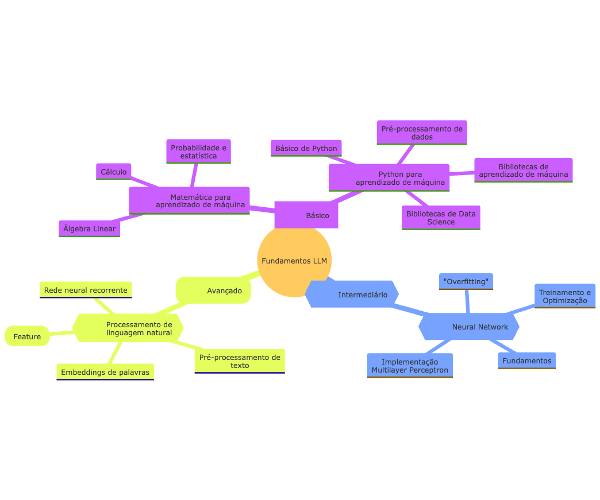
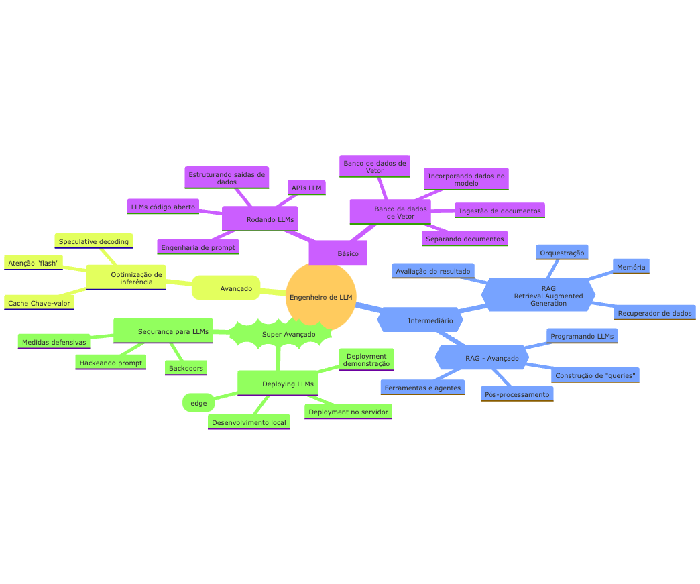

  <h1>🗣️ Projeto de aprendizagem focado em IA Generativa utilizando modelos de LLM por meio de software livre</h1>

Esse projeto é um fork do projeto do [Maxime Labonne](https://mlabonne.github.io/blog/), o original em Inglês mantendo o fork [Readme em Inglês completo](README_ENG.md)

## O curso de LLM é dividido em 3 partes (2 em Português no momento):

1. 🧩 **Fundamentos de LLM** 
2. 👷 **Prática para Engenharia de LLM**

## 🧩 Fundamentos de LLM

This section introduces essential knowledge about mathematics, Python, and neural networks. You might not want to start here, but refer to it as needed.

## 👷 Prática para engenharia de LLM

This section of the course focuses on learning how to build LLM-powered applications that can be used in production, with a focus on augmenting models and deploying them.

# Changelog
* 18.04.2024 - Adicionando imagens em PT_BR

# Roadmap
* Falta muita coisa...
